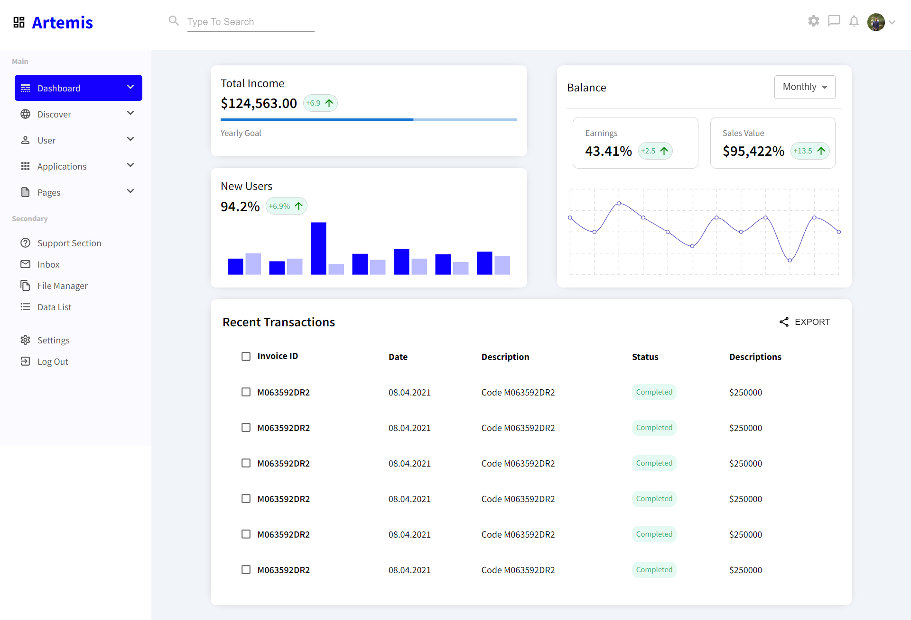

# Dashboard Made using ReactJs and Material UI

Live App: https://react-dashboard-task-harsh.netlify.app/

[CodeSandBox](https://shorturl.at/hqrW6)

<!-- Screenshot -->

## Pre-requisites

- [NodeJs](https://nodejs.org/en/download/)

## Installation

- Clone the repository
- Run `npm install` to install all the dependencies
- Run `npm start` to start the server
- Open `http://localhost:3000` in your browser
